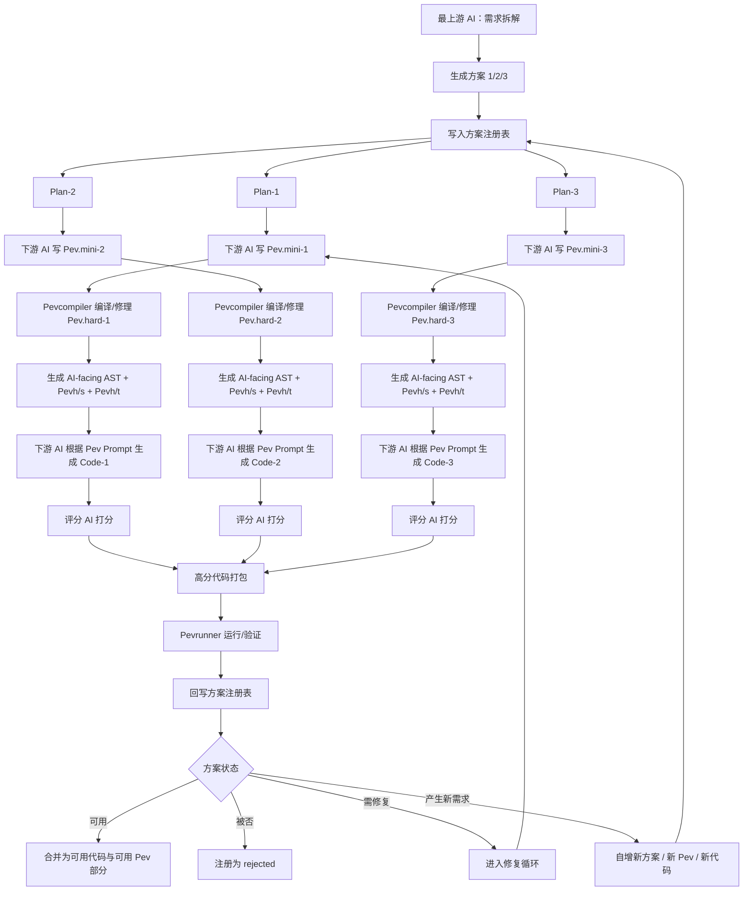

# Pev 循环体：从方案拆解到代码自增的多 AI 编排流程

Pev 的核心并不是让某一个 AI 一次性完成整个项目，而是把项目拆成一组可以被编译、生成、评分、验证、注册的循环单元。

在这个结构里，AI 不再只是“写代码的助手”，而是被放进一个更大的生成管线中。真正持有流程状态的是 Pevcompiler、方案注册表和 Pevrunner。AI 只在不同阶段承担局部任务：写方案、写 Pev.mini、修 Pev.hard、根据 Pev Prompt 生成代码、给代码打分。

这个结构最关键的地方在于：**每一次循环不仅会生成代码，也会生成新的 Pev 部分。**
代码和 Pev 会一起自增，形成一个可继续扩展的项目骨架。

---

## 一、术语解释

### Pev

Pev 是面向 AI 代码生成的 intent-spec 系统。它不是普通 prompt，而是代码生成背后的稳定意图规格。

可以理解为：

```text
Pev = intent spec
Prompt = transport format
Code = generated artifact
```

在 Pev 管辖范围内，代码不是唯一事实源。Pev 才是逻辑骨架和生成约束的事实源。

---

### Pev.mini

Pev.mini 是 human-facing DSL，也就是面向人类编辑的 Pev 语言。

它更适合人类书写、阅读、修改。
下游 AI 可以先根据上游方案写出 Pev.mini，再交给编译器处理。

---

### Pev.hard

Pev.hard 是 machine-facing DSL，也就是面向机器编译和执行链路的严格语言。

Pev.mini 会被编译成 Pev.hard。
这个过程类似：

```text
Pev.mini → Pev.hard
```

它接近：

```text
.py → .pyc
```

但 Pev.mini 和 Pev.hard 不是简单的一一映射关系。Pev.hard 是另一套更严格、更机器化的语言结构。

---

### Pev.hards / Pev.hardu

Pev.hards 是未完全剪枝的 Pev.hard 版本，保留更多语法糖和可读结构。
Pev.hardu 是完全剪枝、补全后的版本，更接近机器执行和后续 AST 编译。

可以粗略理解为：

```text
Pev.hards = 人类仍相对可读的 hard 版本
Pev.hardu = 剪枝补全后的机器友好版本
```

---

### AI-facing AST

AI-facing AST 是给 AI 看的编译后产物。

它不是直接运行的 AST，而是把 Pev.hard 编译成 AI 可以理解的任务语义对照。
其中包含代码生成所需的约束、目标、字段、接口、状态规则、错误处理、幂等规则等。

它的目标不是运行，而是让 AI 稳定生成代码。

---

### Machine-facing AST

Machine-facing AST 是给机器执行链看的 AST。

它用于 Pevrunner、Pev.runs 或本地解释器判断 AI 交付的代码是否符合 Pev 的机器规则。

---

### ToaiPev

ToaiPev 是 AI-facing semantic DSL。
它本身不能运行，是一种“假语言”，只用于让 AI 理解任务逻辑、生成约束和交付要求。

它的作用是：

```text
让 AI 理解如何生成代码
而不是让机器直接执行
```

---

### Pevh

Pevh 是 Pev 的子任务模块。
它通常承载某个局部功能、局部代码页、局部逻辑单元。

一个 Pevc 可以调用多个 Pevh：

```text
Pevc-root
├─ Pevh-A1
├─ Pevh-A2
└─ Pevh-B1
```

---

### Pevs

Pevs 是语义映射、字段还原和审计解释层。

如果代码生成阶段使用了遮蔽字段名、随机别名、base32 命名或业务语义替换，Pevs 负责把这些遮蔽命名还原回真实业务命名。

---

### Pevh/s 与 Pevh/t

在这个循环说明里，Pevh/s 可以理解为 Pevh 的语义/结构切片，用于保留子任务对应的结构关系、约束和解释信息。

Pevh/t 可以理解为 Pevh 的任务投递切片，用于给下游 AI 生成代码时使用。

也就是说：

```text
Pevh/s = 子任务的结构/语义侧
Pevh/t = 子任务的投递/执行侧
```

---

### Pevcompiler

Pevcompiler 是 Pev 编译器。

它负责把 Pev.mini 编译成 Pev.hard，再进一步生成 AI-facing AST、machine-facing AST、Pevh/s、Pevh/t、ToaiPev Prompt 等中间产物。

---

### Pevrunner

Pevrunner 是本地解释器、调度器和验证器。

它不是 AI。
它不需要理解完整业务叙事，也不需要像 Agent 那样持续对话。它只需要拿到代码交付结果、运行结果、验证结果，并把方案状态写回注册表。

---

### 方案注册表

方案注册表是整个循环的状态中心。

它记录：

```text
方案编号
方案来源
对应 Pev.mini
对应 Pev.hard
对应 Pevh/s
对应 Pevh/t
代码产物
评分结果
Pevrunner 运行结果
方案状态：待生成 / 可用 / 被否 / 需要修复 / 已合并
```

它让多个方案可以并发生成、并发评分、并发验证，同时又能回到统一状态表中进行管理。

---

## 二、完整子循环：一个方案如何从需求变成代码

一个完整 Pev 子循环可以分成七个阶段。

---

### 阶段 1：最上游 AI 生成方案拆解

最上游 AI 首先根据需求生成多个方案，例如：

```text
方案 1
方案 2
方案 3
```

每个方案可以是不同的实现路径、不同的模块拆法、不同的状态机设计、不同的数据结构设计，或者不同的代码生成策略。

同时，最上游 AI 会写出方案注册表。

注册表的作用是把每个方案变成一个可追踪的分支：

```text
Plan-1: pending
Plan-2: pending
Plan-3: pending
```

从这一刻开始，方案之间可以互相隔离，也可以并发执行。

---

### 阶段 2：下游 AI 根据方案写 Pev.mini

下游 AI 不直接写最终代码，而是先根据方案生成 Pev.mini。

例如：

```text
Plan-1 → Pev.mini-1
Plan-2 → Pev.mini-2
Plan-3 → Pev.mini-3
```

Pev.mini 是面向人类和编译器前端的规格语言。
它的作用不是直接运行，而是把方案转换成可编译的 Pev 规格。

这个阶段生成的是新的 Pev 部分，而不是代码本身。

---

### 阶段 3：Pevcompiler 编译并修理 Pev.hard

Pev.mini 被拉回后进入 Pevcompiler。

编译器会尝试把 Pev.mini 转成 Pev.hard：

```text
Pev.mini-1 → Pev.hard-1
Pev.mini-2 → Pev.hard-2
Pev.mini-3 → Pev.hard-3
```

如果 Pev.mini 编译失败，会进入修理流程。

修理可以由另一个 AI 完成，也可以由 Pev 工具链反馈错误后让 AI 修改。

典型问题包括：

```text
语法不通过
字段未声明
约束冲突
状态迁移不完整
接口签名不一致
Pev.hard 严格规则不满足
```

只有通过编译的 Pev.hard 才能进入下一阶段。

这一阶段的关键是：**Pev.mini 不是最终规格，Pev.hard 才是进入后续生成链路的严格机器规格。**

---

### 阶段 4：Pev.hard 编译成 AI-facing AST、Pevh/s、Pevh/t

通过编译后，Pev.hard 会继续被拆解和派生。

它会生成：

```text
AI-facing AST
Machine-facing AST
Pevh/s
Pevh/t
ToaiPev Prompt
```

其中：

```text
AI-facing AST
```

负责给 AI 看，让 AI 明白该生成什么代码。

```text
Machine-facing AST
```

负责给 Pevrunner 或本地解释器看，用于判断代码结果是否符合机器规则。

```text
Pevh/s
```

保存子任务的结构和语义信息。

```text
Pevh/t
```

保存子任务投递给 AI 的任务形态。

这一步会把“方案规格”进一步变成“可投递给代码生成 AI 的局部任务”。

---

### 阶段 5：更下游 AI 根据 Pev Prompt 生成代码

再下游的 AI 拿到编译好的 Pev Prompt。

这个 Prompt 不是原始需求，而是从 Pev.hard / AI-facing AST / ToaiPev 派生出来的任务投递包。

此时下游 AI 看到的是：

```text
输入字段
输出字段
接口约束
状态迁移规则
幂等规则
错误处理规则
日志规则
交付模板
代码结构目标
```

它不一定需要知道完整业务目的。
它只需要根据 Pev Prompt 生成符合规格的代码。

于是每个方案分支会生成自己的代码候选：

```text
Plan-1 → Code-1
Plan-2 → Code-2
Plan-3 → Code-3
```

---

### 阶段 6：评分 AI 对代码结果打分

代码生成后，不直接进入主项目。

另一个 AI 或评分系统会对代码进行评价。

评分对象可以包括：

```text
是否符合 Pev Prompt
是否符合接口
是否覆盖边界条件
是否满足幂等要求
是否满足错误处理要求
是否符合交付模板
是否存在明显实现缺陷
是否适合进入 Pevrunner
```

每个代码候选会得到评分：

```text
Code-1: 82
Code-2: 91
Code-3: 67
```

分数高的代码被拉回打包。
分数低的代码可以被否决，也可以进入修复循环。

---

### 阶段 7：Pevrunner 运行、验证并回写注册表

高分代码被打包后放入 Pevrunner。

Pevrunner 不需要像 AI 一样理解完整自然语言需求。
它只需要知道：

```text
代码结果是什么
对应哪个方案
对应哪个 Pev.hard
对应哪个 machine-facing AST
运行结果是否通过
验证结果是否通过
```

然后 Pevrunner 把结果写回方案注册表：

```text
Plan-1: rejected
Plan-2: usable
Plan-3: needs repair
```

这一步完成后，一个完整子循环结束。

---

## 三、流程图



---

## 四、循环体的核心：代码和 Pev 同时自增

这个循环最重要的地方，不是“生成代码”，而是每次循环都会同时产生两类新增物：

```text
新增代码
新增 Pev
```

具体来说，每个成功方案都会带来：

```text
新的 Pev.mini
新的 Pev.hard
新的 AI-facing AST
新的 Pevh/s
新的 Pevh/t
新的代码候选
新的评分记录
新的 Pevrunner 运行结果
新的方案注册状态
```

所以项目不是只靠代码增长，而是靠 Pev 图谱和代码产物一起增长。

可以理解为：

```text
一次循环 = 一次规格增长 + 一次代码增长 + 一次验证记录增长
```

---

## 五、方案循环为什么可以并发

方案 1、方案 2、方案 3 之间本来就是孤立分支。

它们可以同时进入不同的下游 AI：

```text
Plan-1 → AI-A → Pev.mini-1 → Pev.hard-1 → Code-1
Plan-2 → AI-B → Pev.mini-2 → Pev.hard-2 → Code-2
Plan-3 → AI-C → Pev.mini-3 → Pev.hard-3 → Code-3
```

这些分支在生成阶段不需要互相等待。

只要每个分支都能回到方案注册表，就可以统一管理：

```text
Plan-1: rejected
Plan-2: usable
Plan-3: pending
```

并发的好处是：

```text
多个方案可以同时探索
多个 Pev 分支可以同时生成
多个代码候选可以同时评分
失败方案不会阻塞成功方案
```

这使得 Pev 循环更像一个并发搜索系统，而不是线性开发流程。

---

## 六、完整子循环的叙事版

一个 Pev 子循环通常从最上游 AI 开始。最上游 AI 不直接写代码，而是先把需求拆成多个可能的实现方案，并写入方案注册表。每个方案都成为一个独立分支。

随后，下游 AI 按照这些方案生成 Pev.mini。Pev.mini 是面向人类和编译器前端的 DSL，用来描述方案背后的意图规格。Pev.mini 被拉回后进入 Pevcompiler，编译成更严格的 Pev.hard。如果编译失败，就根据错误继续修理，直到生成可通过编译的 Pev.hard。

Pev.hard 通过编译后，会进一步生成 AI-facing AST、machine-facing AST、Pevh/s、Pevh/t 等产物。AI-facing AST 和 ToaiPev Prompt 负责给下游代码生成 AI 阅读；machine-facing AST 和 Pevh/t 则用于后续 Pevrunner 的验证和执行链路。

接下来，更下游的 AI 根据编译好的 Pev Prompt 生成代码。这个 AI 不一定知道完整业务目的，它只需要按照 Pev Prompt 中的输入、输出、状态规则、幂等规则、日志规则、错误处理规则和交付模板生成代码。

代码生成后，另一个 AI 或评分系统会对代码进行打分。评分高的代码会被拉回打包，并交给 Pevrunner。Pevrunner 不需要理解完整需求叙事，它只需要运行代码、检查结果、对照机器规则，然后把方案状态写回注册表。

如果方案通过，注册表会把它标记为可用；如果失败，则标记为被否；如果需要修改，则进入修复循环；如果运行结果产生新的需求或新的拆解方向，则注册表会继续自增新的方案、新的 Pev 分支和新的代码任务。

因此，Pev 循环不是一次性的代码生成，而是一个可以持续扩展的生成系统。

---

## 七、这个循环为什么强

这个循环的强度来自三个结构。

第一，它把代码生成拆成了多个稳定阶段：

```text
方案 → Pev.mini → Pev.hard → AST/Pevh → Code → Score → Runner → Registry
```

每个阶段都有自己的产物，不依赖单个 AI 一次性完成全部任务。

第二，它把 AI 从“全局项目负责人”降级为“局部任务执行者”。
不同 AI 可以分别负责方案、Pev、代码、评分。每个 AI 只处理局部上下文，最终由 Pevcompiler、Pevrunner 和方案注册表维持整体结构。

第三，它允许项目持续自增。
一次循环不仅产生代码，也产生新的 Pev 规格、新的 AST、新的 Pevh 分支和新的验证记录。成功方案可以合并，失败方案可以丢弃，半成功方案可以修复，新发现的问题可以继续拆成新方案。

最终形成的是一种循环式项目生长结构：

```text
需求拆解
→ 方案生成
→ Pev 生成
→ 代码生成
→ 评分验证
→ 注册状态
→ 新需求 / 新方案 / 新 Pev / 新代码
→ 再循环
```

---

## 八、压缩总结

Pev 循环的本质是：

```text
让 AI 生成方案；
让 AI 写 Pev；
让编译器把 Pev 变成严格中间产物；
让 AI 根据中间产物生成代码；
让评分系统筛选代码；
让 Pevrunner 验证代码；
让注册表记录结果；
再把结果变成下一轮 Pev 和代码增长的起点。
```

它不是单次 prompt 生成代码，而是一个围绕 Pev 规格、代码候选、评分结果和运行验证不断自增的多 AI 编排循环。

这个循环可以串行执行，也可以并发执行。
当方案 1、方案 2、方案 3 同时展开时，每个方案都可以独立生成 Pev、生成代码、打分、验证，最后统一回写到方案注册表。

因此，Pev 的循环体真正体现的是：

```text
并发方案搜索
+ Pev 规格自增
+ 代码产物自增
+ 注册表状态管理
+ Pevrunner 验证闭环
```

这就是 Pev 从“提示词规格”上升到“AI-native intent-spec 编排系统”的关键。
